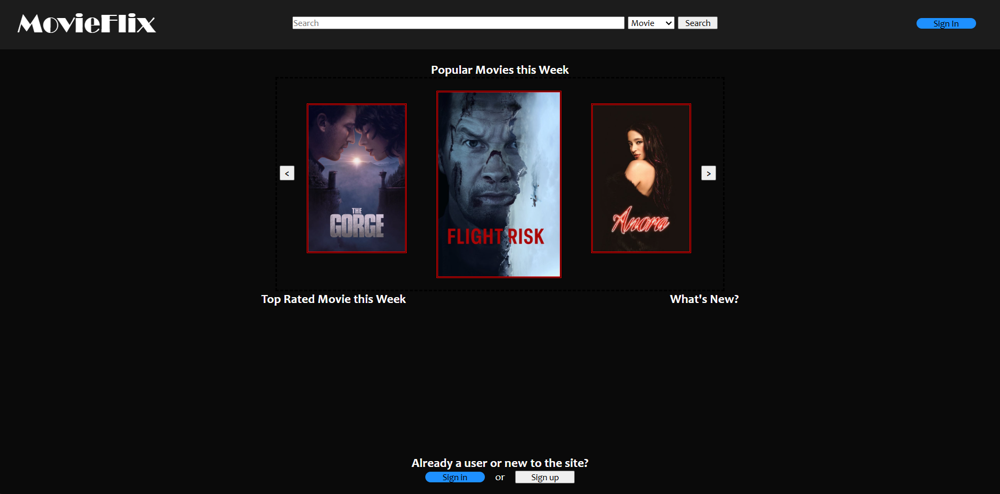
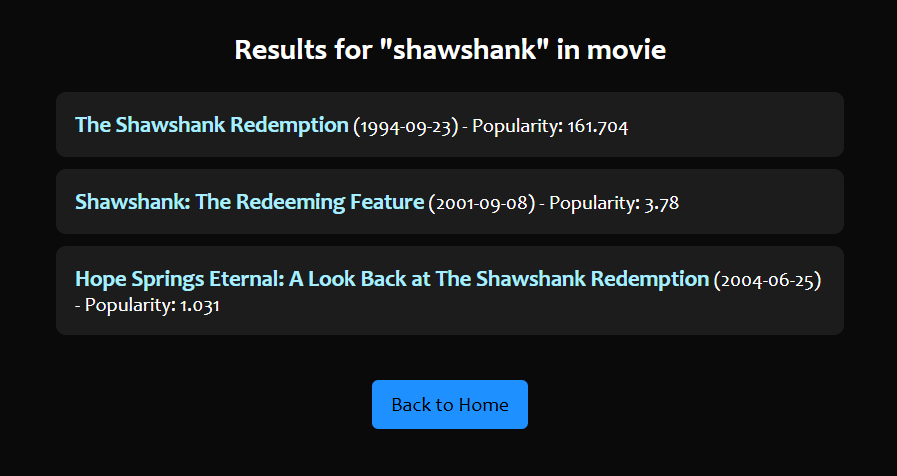
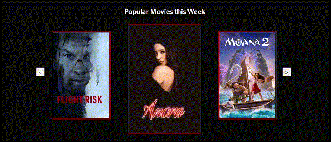

# MovieFlix by BlueCircuit
A Software Design &amp; Analysis Course Project

### MovieFlix Homepage

  

### Results Pages

  

### Trending Carousel

  

## Requirements

Use of MovieFlix will require Python3 and the Python libraries 'Flask' and 'tmdbsimple'

These libraries can be installed by using pip in your shell of choice and running the commands:
- pip install flask
- pip install tmdbsimple

## Setup

You will first need a txt file with your API Key for the TMDB API in your root directory named 'apikey.txt'

Then, to run MovieFlix locally, simply run the app.py file in your IDE and access the page by directing your browser to the IP address displayed in your terminal

  

