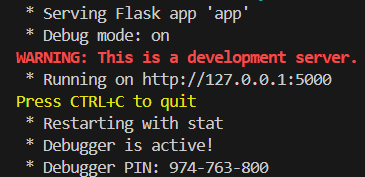

# MovieFlix by BlueCircuit
<div align="center">
  
</div>
<br>

MovieFlix is a full-stack movie cataloguing and discovery web application, designed using Python, Flask, and The Movie Database (TMDb) API. The goal of the project is to give users a modern, interactive platform where they can search for movies, TV shows, and people (actors, directors, etc.), view detailed information, and build a personalized watchlist. The application mimics the functionality of popular movie platforms by dynamically fetching data from TMDb and presenting it with rich visuals, genre tags, cast listings, posters, ratings, and more.

The backend is powered by Flask and structured around modular files (movies.py, search.py, login.py) that encapsulate all TMDb API logic, user authentication, and search filtering. User accounts are stored in a SQLite database, and Flask sessions manage login state. Users can log in, sign up, and save movies to their watchlists — which are rendered using the same logic as the global search results. The frontend is built with HTML, CSS, and JavaScript, including interactive components like a trending movie carousel, modals, and hover effects. Unit testing is handled with pytest and mocking to ensure isolated, testable logic across user authentication, data fetching, and presentation.

Overall, MovieFlix is a self-contained, testable, and deployable web app that serves as a robust foundation for learning web development, Flask, RESTful APIs, and full-stack architecture.

## Simple Setup

Using MovieFlix is incredibly simple; if you would like to run the application locally without worrying about installing the requirements, you can simply download the MovieFlix.exe file. After double-clicking the executable, a terminal will open similar to the one below, and the webpage will open automatically. To exit, simply close the terminal and webpage.
<div align="center">
  
</div>
<br>

## Developer Setup

### Requirements

To run MovieFlix through an IDE, it will require Python3 and the Python libraries 'Flask', 'Flask-SqlAlchemy', 'Werkzeug', and 'TmdbSimple'

These libraries can be installed by using pip in your shell of choice and running the command:
```
pip install flask flask-sqlalchemy tmdbsimple werkzeug
```
### To run

After cloning the repository into the directory of your choice. You will first need a txt file containing your API Key for TMDB's API in your root directory titled 'apikey.txt'

Then, to run MovieFlix locally, simply run the MovieFlix.py file in your IDE and the page should open automatically. To exit, CTRL+C the terminal and exit the webpage.

<div align="center">
  
</div>
<br>

## Images

### MovieFlix Homepage
<div align="center">
  
</div>

### Results Pages
<div align="center">
  
</div>

### Movie/TV Show Pages
<div align="center">
  
</div>

### Person Pages
<div align="center">
  
</div>

### Trending Carousel
<div align="center">
  
</div>

### Login Modal
<div align="center">
  
</div>

### Account Creation Modal
<div align="center">
  
</div>

### Account Dropdown
<div align="center">
  
</div>

### Watchlist Page
<div align="center">
  
</div>
